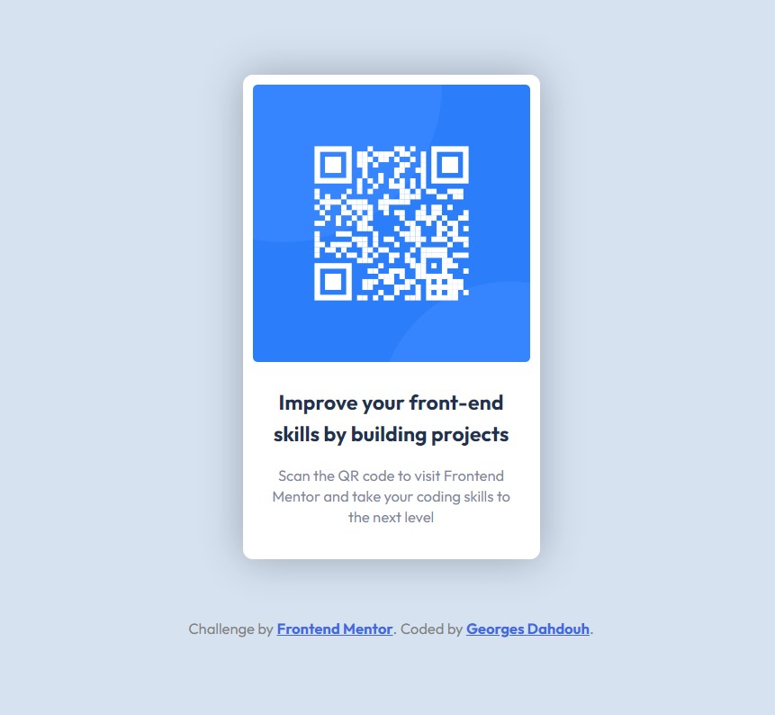

# Frontend Mentor - QR code component

## First challenge submission by Georges Dahdouh

## Welcome! 👋

Thanks for checking out this front-end coding challenge.

[Frontend Mentor](https://www.frontendmentor.io) challenges help you improve your coding skills by building realistic projects.

## The challenge

The challenge is to build out this QR code component and get it looking as close to the design as possible.
I made this challenge to test the Frontend Mentor platform and submission.
Thank you for visiting!

## GitHub Pages Link

- [GitHub Pages](https://sergeod9.github.io/QR-code-card/)
